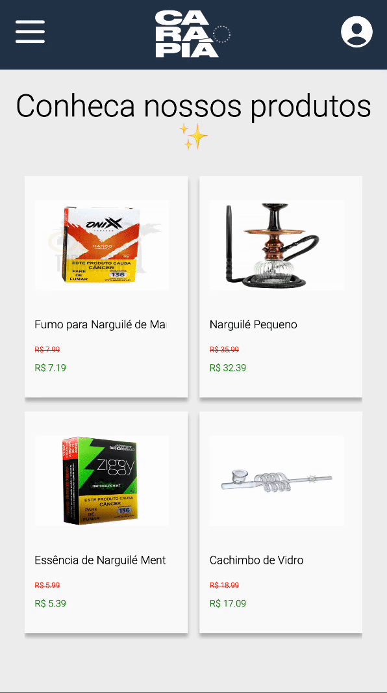

# EcommerceBack

Design of a Ecommerce application ! With the right to register, login, logout, and buy products !



Try it out now at https://projetao-ecommerce-front.vercel.app <br/>
Check out the FrontEnd on https://github.com/mateuspit/projetao-ecommerce-front

## About

This is the Front-end of our full-stack web application ! With data persistence ! It's a simple Ecommerce, below are the implemented features:

- Sign Up
- Login
- LogOut
- List of products
- Procuts by Id
- Buy products

## Technologies
The following tools and frameworks were used in the construction of the project, you can find the full list on the package.json:<br>
<p>
  
  
  
  
  
  
  
  
  

  
</p>

## How to run

1. Clone this repository
2. Install dependencies
```bash
npm i
```
3. Create a .env file on the root of the project with the following variables
```bash
DATABASE_URL=yourDataBaseURL
PORT=YourBackEndPORT
```
3. Run the back-end with
```bash
npm start
```
4. You can optionally run the project with auto reload after changes
```bash
npm run dev
```
5. Finally send a request to http://localhost:YourBackEndPORT/SomeRouteImplemented and see it running !
